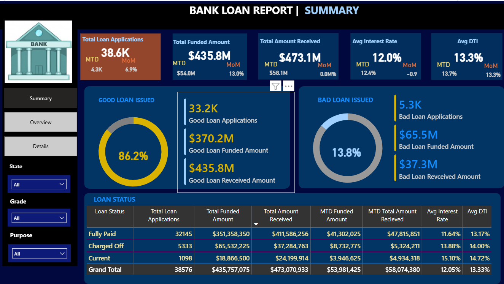
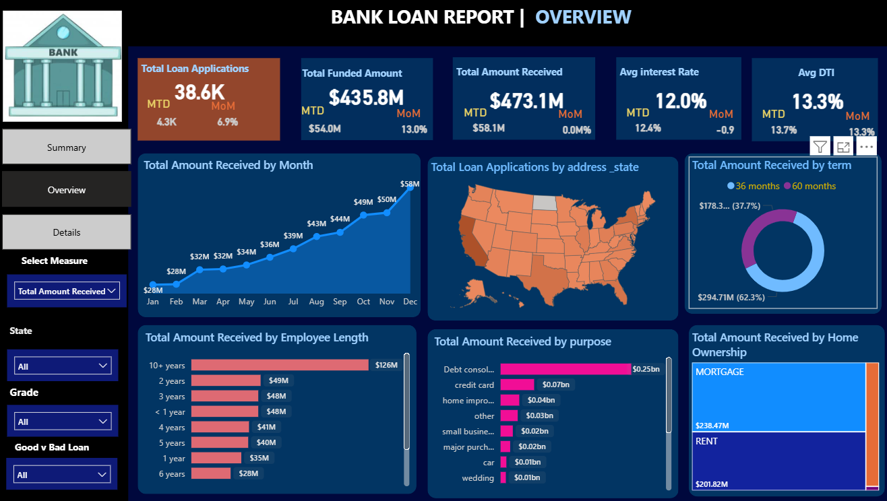
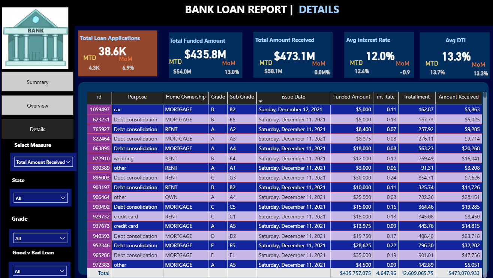

#  Bank Loan Performance Analysis

##  Project Overview
This project analyzes bank loan data to understand loan performance, repayment trends, and customer risk patterns.

The objective is to identify:
- Total loan funded amount
- Total amount received
- Good loan vs Bad loan ratio
- Loan status distribution
- Monthly performance trends

---

##  Tools Used
- SQL (Data Analysis & Querying)
- Power BI (Dashboard & Visualization)
- Excel / CSV Dataset

---

##  Dataset
The dataset contains loan-related information such as:
- Loan amount
- Interest rate
- Loan status
- Issue date
- Total payment
- Customer details

---

##  SQL Analysis
Performed queries to calculate:
- Total funded amount
- Total received amount
- Good loan vs Bad loan percentage
- Loan distribution by status
- Monthly trend analysis

SQL file available in this repository:
Bank_Loan_Analysis.sql

---

##  Power BI Dashboards

### 🔹 Loan Summary

### 🔹 Loan Overview

### 🔹 Loan Details

Power BI file available:
Bank_Loan_Dashboard.pbix

---

##  Project Outcome
This project helps financial institutions:
- Monitor loan performance
- Identify risky loans
- Improve financial decision-making
- Track repayment behavior
